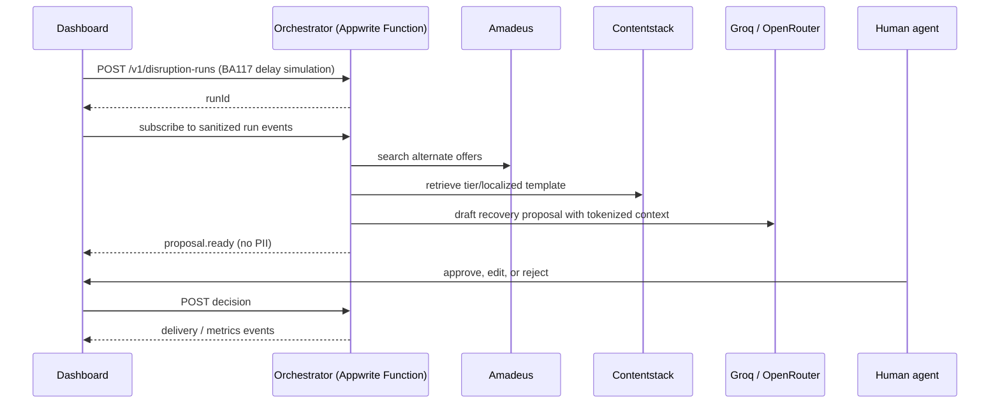

# Architecture and Integration Contract

## Runtime flow

The visible trace is an event projection, not a source of truth. The orchestrator records the decision and enforces the guard that only an approved action can invoke the privileged de-tokenization/delivery adapter.

## Privacy boundary

The model context may contain a passenger token, loyalty tier, non-sensitive preferences, route, disruption type, and the approved brand template. It must not contain a name, email address, telephone number, passport identifier, payment data, booking reference, or raw passenger profile.

The dashboard receives the same limited context. The privileged Appwrite delivery adapter is the only component permitted to resolve the passenger token after an approval; it does not expose resolved identity to the model or browser.

## Contract freeze

The exact request, response, events, states, and error model are in [`contracts/agent-run-contract.md`](../contracts/agent-run-contract.md). Both workflows implement against that document without changing it. Contract changes require a separate, jointly reviewed follow-up commit after both branches are merged.
